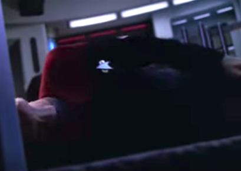
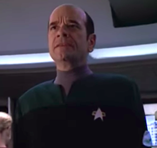
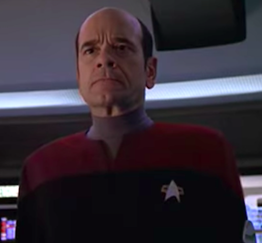

# Holographic Doctor Features

The Emergency Medical Holographic program is designed to provide short-term medical assistance on starships where a full medical crew is not available. It appears as a holographic image of the program's creator.

### Emergency leadership mode

In an emergency, if the ship's captain is incapacitated, the EMH program can automatically promote itself to captain and take command of the ship.

### Convenient medical care

The EMH program can make video calls to your room to check on how you're doing, even if you haven't made an appointment.

### No need to keep lots of bulky medical records

The EMH program stores all observations and interactions with its patients in its massive database so that it can offer the best possible medical care.

### New features being developed all the time

The EMH program is capable of modifying its software to add exciting new features, including its own holographic friends and family to better simulate a real human doctor.

### Holographic consent and background information surrogate

If you are unconscious or otherwise unable to provide your medical history prior to a procedure, the EMH program will make a holographic copy of your body and transmit your brain waves to it. This way, it can interview the hologram version of yourself while your physical body is in stasis. The hologram is also qualified to consent on your behalf.

