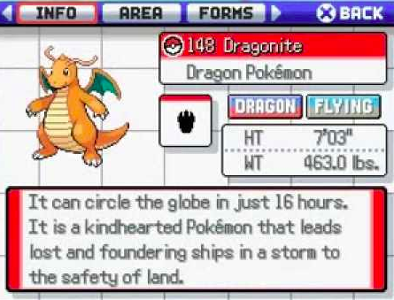

In order to accomplish Professor Oak's goal of a complete Pokemon database, the Pokedex is designed to find and record data on each Pokemon the user meets.

Pokedex use cases:

* The user encounters a new Pokemon, and data about the Pokemon is recorded and added to the Pokedex. Users may simply point the Pokedex at an individual. The Pokedex will then display a picture and read the entry out loud. It uses a small camera to take a photo of the Pokemon to identify it.

* Entries of previously encountered Pokemon can be reviewed. Data includes an image of the Pokemon, its species, height, weight, the time of day that a Pokémon can be caught, current health, and current location.

* Professor Oak will evaluate the user's Pokedex according to the number of Pokemon they have caught.

* When Pokedexes from the same region are put together, a Pokedex will make a beeping sound as a signal to indicate that another Pokedex is nearby.

* The Pokedex can be used as an ID-card.

Sources:

[https://bulbapedia.bulbagarden.net/wiki/Pokédex](https://bulbapedia.bulbagarden.net/wiki/Pokédex)

[http://pokemon.wikia.com/wiki/Pokédex](http://pokemon.wikia.com/wiki/Pokédex)

